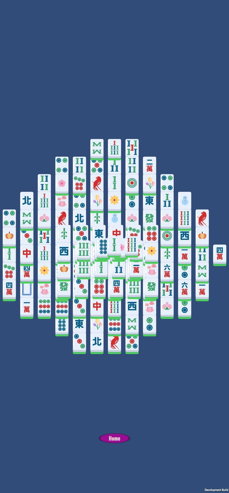

# Mobile Mahjong with Personalized Tiles

A Mahjong Solitaire game for Android, built in Unity (C#), where players can upload their own photos to use as tile images instead of the default tile set.

## Project Goal

- **Core game**: A fully playable, offline Mahjong Solitaire game with standard visibility/selectability and matching rules.
- **Personalized tiles**: Players can upload photos from their gallery to replace default tile artwork, making every board unique.
- **Guaranteed solvable boards**: A standalone C++ module generates and validates board layouts offline (via backtracking search), so every board that ships to the game is solvable.
- **Local-first**: Scores and photos are stored locally via SQLite — the game is fully playable with no internet connection.
- **Shared features (optional)**: A Python (FastAPI) backend and remote database power a cross-device leaderboard and let players save/share personalized tile photos.

### Architecture at a glance
| Component | Tech | Role |
|---|---|---|
| Client | Unity (C#) | Board rendering, input, game rules, photo upload UI |
| Board generator/solver | C++ | Offline board generation + solvability check (backtracking) |
| Local storage | SQLite | Scores, photos, cached layouts — offline play |
| Backend | Python (FastAPI) | Photo processing/storage, leaderboard API |
| Remote DB | PostgreSQL/SQLite | Shared leaderboard + photo metadata |

Full scope, non-goals, and engineering write-up are in the capstone proposal (see `docs/`).

## Current Status

🚧 **Work in progress.** So far:

- **Unity client**: Core board rendering and tile logic running on Android (see screenshot below — development build).
- **Backend connection**: Initial client → server connection test completed, confirming the Unity client can reach the Python backend.

Still to come: photo upload pipeline, C++ board generator/solver integration, leaderboard, and local SQLite persistence.

## Non-goals (for this course project)

- Production-level security/scalability (auth, photo encryption, abuse protection)
- iOS support
- Social features beyond a basic leaderboard (comments, friends, chat)
